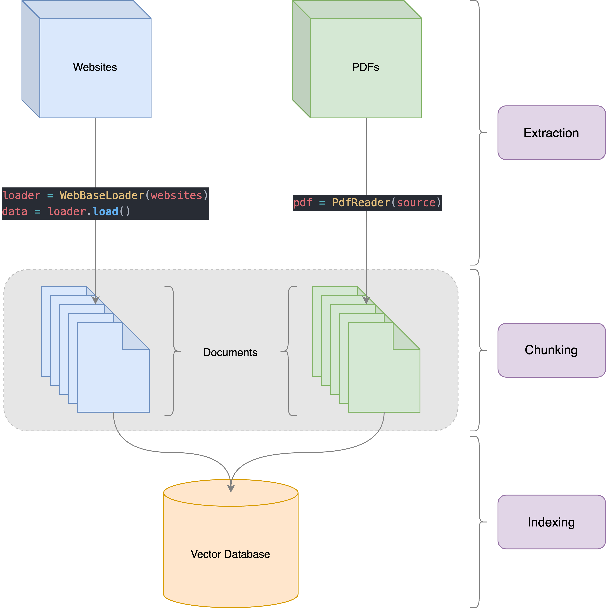
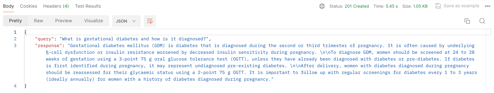
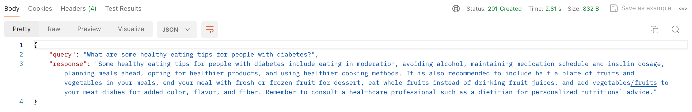
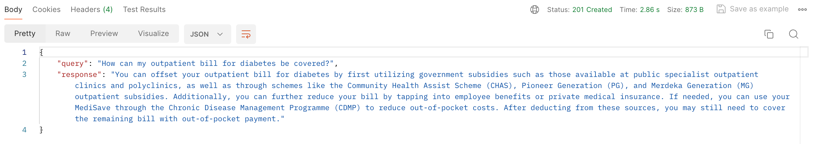

# Healthcare Chatbot

## Overview

### Data Pipeline



### Postman

The LLM model is wrapped in an API endpoint and Postman was used to evaluate the responses of the model. The following are some query and response pairs:





### FastAPI

Run the following command in the root of the project. This exposes the FastAPI application at port 8000 on your local machine.

```
uvicorn app.main:app --reload --port=8000
```

On Postman, you can then call the `/chat` endpoint as a POST request with the query as the payload. The response will be a JSON containing the query and request pair as shown in the images above.

## Rules and guidelines

In order to get the best out of the template:

- Don't remove any lines from the `.gitignore` file we provide
- Make sure your results can be reproduced by following a [data engineering convention](https://docs.kedro.org/en/stable/faq/faq.html#what-is-data-engineering-convention)
- Don't commit data to your repository
- Don't commit any credentials or your local configuration to your repository. Keep all your credentials and local configuration in `conf/local/`

## Create a virtual environment

Create a virtual environment before installing the dependencies required to run this project.

To create a virtual environment, use Anaconda (recommended):

```
conda create -n <ENV_NAME>  python=3.10 -y
```

## How to install dependencies

Declare any dependencies in `requirements.txt` for `pip` installation.

To install them, run:

```
pip install -r requirements.txt
```

## How to run your Kedro pipeline

You can run your Kedro project with:

```
kedro run
```

## How to run specific pipeline

You can run specific pipeline with:

```
kedro run --pipeline=data_processing
```

> **Note:** There is only one pipeline called `data_processing` in this project.

## How to run specific nodes

You can run specific nodes with:

```
kedro run --nodes="index_websites_node"
kedro run --nodes="index_pdfs_node"
```

> **Note:** There are two nodes which are part of the same pipeline called `data_processing` in this project.

## Project dependencies

To see and update the dependency requirements for your project use `requirements.txt`. Install the project requirements with `pip install -r requirements.txt`.

[Further information about project dependencies](https://docs.kedro.org/en/stable/kedro_project_setup/dependencies.html#project-specific-dependencies)

## How to work with Kedro and notebooks

> Note: Using `kedro jupyter` or `kedro ipython` to run your notebook provides these variables in scope: `catalog`, `context`, `pipelines` and `session`.
>
> Jupyter, JupyterLab, and IPython are already included in the project requirements by default, so once you have run `pip install -r requirements.txt` you will not need to take any extra steps before you use them.

### Jupyter

To use Jupyter notebooks in your Kedro project, you need to install Jupyter:

```
pip install jupyter
```

After installing Jupyter, you can start a local notebook server:

```
kedro jupyter notebook
```

### JupyterLab

To use JupyterLab, you need to install it:

```
pip install jupyterlab
```

You can also start JupyterLab:

```
kedro jupyter lab
```

### IPython

And if you want to run an IPython session:

```
kedro ipython
```

### How to ignore notebook output cells in `git`

To automatically strip out all output cell contents before committing to `git`, you can use tools like [`nbstripout`](https://github.com/kynan/nbstripout). For example, you can add a hook in `.git/config` with `nbstripout --install`. This will run `nbstripout` before anything is committed to `git`.

> _Note:_ Your output cells will be retained locally.

[Further information about using notebooks for experiments within Kedro projects](https://docs.kedro.org/en/develop/notebooks_and_ipython/kedro_and_notebooks.html).

## Package your Kedro project

[Further information about building project documentation and packaging your project](https://docs.kedro.org/en/stable/tutorial/package_a_project.html).
