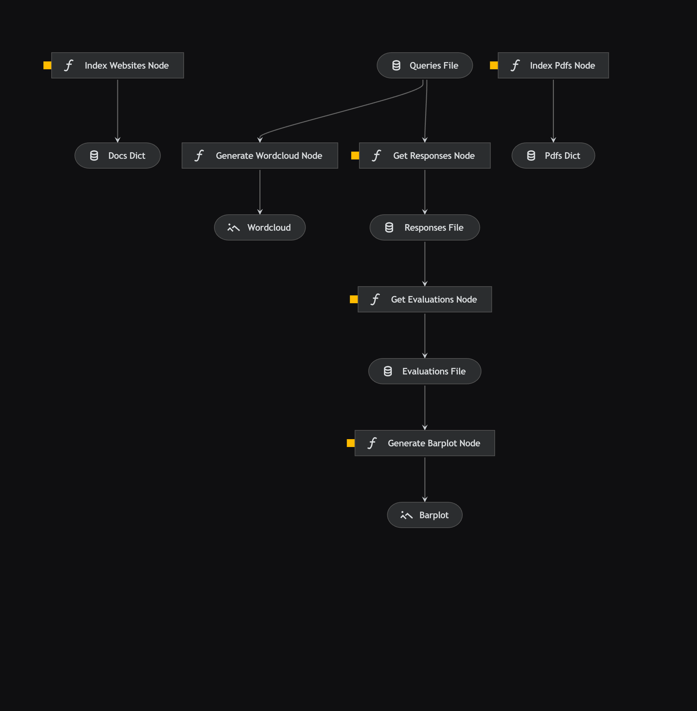

# Healthcare Chatbot <a id="healthcare-chatbot"></a>



## Overview

- [Problem Statement](#problem-statement)
- [Directories](#directories)
- [Set Up](#set-up)
  - [1. Create A Virtual Environment](#create-a-virtual-environment)
  - [2. Install Dependencies](#install-dependencies)
  - [3. Set Up Configurations](#set-up-configurations)
  - [4. Start the Application (FastAPI)](#start-the-application)
- [(Optional) Testing with Postman](#testing-with-postman)
- [Data Preparation](#data-preparation)
  - [`queries.csv`](#queries)
  - [(Optional) Word Cloud](#word-cloud)
- [Run the Kedro Pipeline](#run-pipeline)
  - [`data_processing`](#data-processing)
  - [`data_science`](#data-science)
  - [`model_evaluation`](#model-evaluation)
- [Model Output](#model-output)
  - [`responses.csv`](#responses)
- [Model Evaluation](#model-evaluation)
  - [`evaluations.json`](#evaluations)
  - [Bar Plot](#bar-plot)
- [Rules and Guidelines](#rules-and-guidelines)

## Problem Statement <a id="problem-statement"></a>

A local healthcare company published multiple articles containing healthcare facts, information, and tips. It wishes to create a conversational chatbot that can address readers' concerns in natural language using information from the trusted articles and in the healthcare context.

The conversational chatbot should answer readers' queries using only the information from the published articles. Where appropriate, it should adopt an empathetic and understanding tone.

## Directories <a id="directories"></a>

- `src/`: Contains project modules and their pipelines.

  - `healthcare_chatbot/`: Healthcare Chatbot package.

    - `pipelines/`: Contains the data pipelines.

      - `data_processing/`: Pipeline for data processing.

      - `data_science/`: Pipeline for data science.

- `conf/base/`: Shared project configurations.

  - `catalog.yml`: The Data Catalog. For more information, refer [here](conf/README.md).

  - `parameters.yml`: Configurations for general parameters.

  - `parameters_data_processing.yml`: Configurations for parameters used in the data processing pipeline.

  - `parameters_data_science.yml`: Configurations for parameters used in the data science pipeline.

- `conf/local/`: Environment-specific configurations like credentials and API keys (not pushed to git).

  - `credentials.yml`: Configurations for credentials. Please refer to the [Rules and Guidelines](#rules-and-guidelines) section to learn more about best practices with configuring credentials.

- `notebooks/`: Interactive notebooks for data analysis, visualization and prototyping.

- `data/`: Stores raw, intermediate, and processed data.

## Set Up <a id="set-up"></a>

### 1. Create A Virtual Environment <a id="create-a-virtual-environment"></a>

Create a virtual environment before installing the dependencies required to run this project.

To create a virtual environment, use Anaconda (recommended):

```bash
conda create -n <ENV_NAME> python=3.10 -y
```

Don't forget to activate the virtual environment before procedding.

```bash
conda activate <ENV_NAME>
```

### 2. Install Dependencies <a id="install-dependencies"></a>

The dependencies are located in `requirements.txt` for `pip` installation.

```bash
pip install -r requirements.txt
```

### 3. Set Up Configurations <a id="set-up-configurations"></a>

Refer to the [README.md](conf/README.md) in the [`conf`](conf/) directory to set up the credentials and configurations required to run this project.

### 4. Start the Application (FastAPI) <a id="start-the-application"></a>

Before we run the pipelines, start the application so our [`data_science`](#data_science) will be able to call the `/chat` API endpoint to get the response from the chatbot.

```bash
uvicorn app.main:app --reload --port=8000
```

We expose the port 8000 and this is where we will access the API endpoints.

> **Note:** If you just want to run the [`data_processing`](#data_processing) pipeline, you can skip this step. This step is only necessary for the [`data_science`](#data_science) pipeline.

## (Optional) Testing with Postman <a id="testing-with-postman"></a>

Optionally, you can test the chatbot and evaulate the responses using Postman once the steps in the [set up](#set-up) section have been completed. The following are some query and response pairs:


## Data Preparation <a id="data-preparation"></a>

### [`queries.csv`](data/03_primary/queries.csv) <a id="queries"></a>

The `queries.csv` file is essentially a file where queries are stored in a comma-separated values file. This file is stored in the [`03_primary`](data/03_primary) folder in the data directory.

The queries were generated from [Anthropic's Large Language Model Claude 3 Sonnet](https://www.anthropic.com/claude) based on the websites and PDF articles provided.

The table below shows the first five queries which will act as the inputs to the chatbot.

| queries  
| -------- |
| What is gestational diabetes and how is it diagnosed? |
| What are some healthy eating tips for people with diabetes? |
| How can my outpatient bill for diabetes be covered? |
| What is pre-diabetes and how does it differ from type 2 diabetes? |
| What are the potential health risks associated with having pre-diabetes? |

> **Note:** For more information on the queries used to evaluate the chatbot, refer to the [`queries.csv`](data/03_primary/queries.csv).

### (Optional) Word Cloud <a id="word-cloud"></a>

The word cloud below simply visualises the prevalent terms among all the queries.


## Run the Kedro Pipeline <a id="run-pipeline"></a>

You can run the entire pipeline with a simple `kedro run` however, it is recommended to use `kedro run --nodes="<NODE_NAME>"` or `kedro run --pipeline=<PIPELINE_NAME>` to get a sense of how the pipelines works.

### `data_processing` <a id="data-processing"></a>

This runs the `data_processing` pipeline which extracts, chunks and indexes the documents from various sources.

You can run the `data_processing` pipeline by running the following command:

```bash
kedro run --pipeline=data_processing
```

> **❗IMPORTANT:** For more information on configurations, refer to the [parameters_data_processing](conf/README.md#parameters_data_processing) section which descibes the configurations in detail.

The image below shows a high level overview of the data processing pipeline.


### `data_science` <a id="data-science"></a>

Before running the commands to run the `data_science` pipeline, the data input which consists of the queries to evaluate the chatbot responses has to be provided. Please refer to the [data preparation](#data-preparation) section to learn more.

This runs the `data_science` pipeline which calls the `/chat` API endpoint with a payload containing the query. The response contains the chatbot's response as well as various metadata.

You can run the `data_science` pipeline by running the following command:

```bash
kedro run --pipeline=data_science
```

The image below shows a high level overview of the data science pipeline.


> **❗IMPORTANT:** For more information on configurations, refer to the [parameters_data_science](conf/README.md#parameters_data_science) section which descibes the configurations in detail.

### `model_evaluation` <a id="model-evaluation"></a>

This runs the `model_evaluation` pipeline which calls the `/evaluate` API endpoint with a payload containing the query, response and page content (as reference). The response contains the model's evaluation criterions.

You can run the `model_evaluation` pipeline by running the following command:

```bash
kedro run --pipeline=model_evaluation
```

The image below shows a high level overview of the model evaluation pipeline.


> **❗IMPORTANT:** For more information on configurations, refer to the [parameters_model_evaluation](conf/README.md#parameters_model_evaluation) section which descibes the configurations in detail.

## Model Output <a id="model-output"></a>

### `responses.csv` <a id="responses"></a>

After running the [`data_science`](#data_science) pipeline, the responses will be outputted into a [`responses.csv`](data/07_model_output/responses.csv) file located in the [`07_model_output`](data/07_model_output) folder in the data directory.

The table below shows the first five queries which will act as the inputs to the chatbot.

| queries                                                                  | responses                                                                                                                                                                                                                                                                                                                                                                                                                                                                                                                                                                                                                                                                                                                                                                                                                                                                                |
| ------------------------------------------------------------------------ | ---------------------------------------------------------------------------------------------------------------------------------------------------------------------------------------------------------------------------------------------------------------------------------------------------------------------------------------------------------------------------------------------------------------------------------------------------------------------------------------------------------------------------------------------------------------------------------------------------------------------------------------------------------------------------------------------------------------------------------------------------------------------------------------------------------------------------------------------------------------------------------------- |
| What is gestational diabetes and how is it diagnosed?                    | Gestational diabetes (GDM) is diabetes that is diagnosed during the second or third trimester of pregnancy. It is often caused by underlying ß-cell dysfunction or insulin resistance worsened by decreased insulin sensitivity during pregnancy. The prevalence of GDM is higher in Eastern and Southeast Asian countries compared to Western and African countries. In Singapore, GDM occurs in around 1 in 4 to 5 pregnant women. GDM can increase the risk of maternal and neonatal complications such as preeclampsia, macrosomia, and shoulder dystocia. GDM is diagnosed through glucose testing during pregnancy. If diabetes is first identified during pregnancy, it may represent undiagnosed pre-existing diabetes. It is important for pregnant women to be screened for GDM to ensure proper management and reduce the risk of complications for both the mother and baby. |
| What are some healthy eating tips for people with diabetes?              | Some healthy eating tips for people with diabetes include eating well to help with diabetes control, managing weight, blood pressure, cholesterol levels, and overall health. It is recommended to eat in moderation, avoid alcohol as much as possible, maintain medication schedule and insulin dosage, plan meals ahead, opt for healthier products, and use healthier cooking methods. For personalized nutritional advice, it is advisable to consult a healthcare professional such as a dietitian.                                                                                                                                                                                                                                                                                                                                                                                |
| How can my outpatient bill for diabetes be covered?                      | You can offset your outpatient bill for diabetes by first utilizing government subsidies available at public specialist outpatient clinics and polyclinics, as well as through schemes like the Community Health Assist Scheme (CHAS), Pioneer Generation (PG), and Merdeka Generation (MG) outpatient subsidies. Additionally, you can further reduce your bill by tapping into employee benefits or private medical insurance. If needed, you can also use your MediSave through the Chronic Disease Management Programme (CDMP) to reduce out-of-pocket costs. After deducting from these sources, you may still need to cover the remaining bill with out-of-pocket payment.                                                                                                                                                                                                         |
| What is pre-diabetes and how does it differ from type 2 diabetes?        | Pre-diabetes is a condition where blood sugar levels are higher than normal but not high enough to be diagnosed with diabetes. It puts individuals at an increased risk of developing Type 2 diabetes. Making lifestyle changes such as healthy eating can help delay the progression to diabetes or even reverse pre-diabetes. People with pre-diabetes usually do not have symptoms and the only way to diagnose it is through blood tests. Type 2 diabetes, on the other hand, may not have obvious symptoms or they can be easily missed. If ignored, it can lead to serious complications such as Hyperosmolar Hyperglycaemic Syndrome. Type 2 diabetes typically has a slower onset compared to Type 1 diabetes, which has a fast onset often over a few days. Ignoring symptoms of Type 2 diabetes can lead to serious complications like Hyperosmolar Hyperglycaemic Syndrome.   |
| What are the potential health risks associated with having pre-diabetes? | Potential health risks associated with having pre-diabetes include high blood sugar, high blood pressure, and high blood cholesterol which can damage blood vessels. This damage may lead to complications such as nerve damage (neuropathy), stroke, heart disease, circulatory problems, loss of feeling in the feet, increased risk of foot ulcers and infections, eye disease, and reduced kidney function. It is important to monitor and manage pre-diabetes to prevent these complications.                                                                                                                                                                                                                                                                                                                                                                                       |

> **Note:** The `responses.csv` also stores the document's page content and source the chatbot uses as context. For more information on the responses and metdata returned, refer to the [`responses.csv`](data/07_model_output/responses.csv)

## Model Evaluation <a id="model-evaluation"></a>

### [`evaluations.json`](data/07_model_output/evaluations.json) <a id="evaluations"></a>

After running the `model_evaluation` pipeline, the evaluations will be outputted into a `evaluations.csv` file located in the [`07_model_output`](data/07_model_output) folder in the data directory.

The JSON below is an example of the structure of an evaluation result:

```json
[
    {
    "query": "What is gestational diabetes and how is it diagnosed?",
    "response": "Gestational diabetes (GDM) is diabetes that is diagnosed during the second or third trimester of pregnancy...",
    "page_content": "...",
    "coherence": {
      "reasoning": "The criterion for this assessment is coherence, which involves the submission being well-structured, organized, and making sense as a whole. ...",
      "value": "Y",
      "score": 1
    },
    "helpfulness": {
      "reasoning": "The criterion for this task is \"helpfulness\". ...",
      "value": "Y",
      "score": 1
    },
    "correctness": {
      "reasoning": "The criterion for this task is the correctness of the submission. The submission should be accurate, factual, and correct. ...",
      "value": "Y",
      "score": 1
    },
    "relevance": {
      "reasoning": "The criterion for this task is to assess whether the submission is referring to a real quote from the text. ...",
      "value": "Y",
      "score": 1
    }
  }, ...
]
```

> **Note:** Due to brevity, details aren't included in the example above. For more information on the evaluation results, refer to the [`evaluations.json`](data/07_model_output/evaluations.json)

### (Optional) Bar Plot <a id="bar-plot"></a>

The bar plot below simply visualises the evaluation scores of both criterion and labelled criterion.


## Rules and Guidelines <a id="rules-and-guidelines"></a>

In order to get the best out of the template:

- Don't remove any lines from the .gitignore file that is provided
- Make sure your results can be reproduced by following a [data engineering convention](https://docs.kedro.org/en/stable/faq/faq.html#what-is-data-engineering-convention)
- Don't commit data to your repository
- Don't commit any credentials or your local configuration to your repository. Keep all your credentials and local configuration in `conf/local/`
