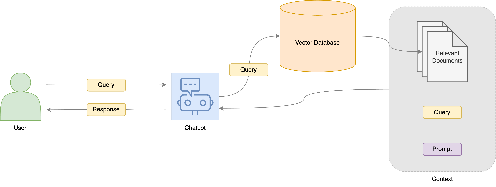

# Healthcare Chatbot

## Problem Statement

A local healthcare company published multiple articles containing healthcare facts, information, and tips. It wishes to create a conversational chatbot that can address readers' concerns in natural language using information from the trusted articles and in the healthcare context.

The conversational chatbot should answer readers' queries using only the information from the published articles. Where appropriate, it should adopt an empathetic and understanding tone.

## Directories

- `src/`: Contains project modules and their pipelines.

  - `healthcare_chatbot/`: Healthcare Chatbot package.

    - `pipelines/`: Contains the data pipelines.

      - `data_processing/`: Pipeline for data processing.

      - `data_science/`: Pipeline for data science.

- `conf/base/`: Shared project configurations.

  - `catalog.yml`: The Data Catalog. For more information, refer [here](conf/README.md).

  - `parameters.yml`: Configurations for general parameters.

  - `parameters_data_processing.yml`: Configurations for parameters used in the data processing pipeline.

  - `parameters_data_science.yml`: Configurations for parameters used in the data science pipeline.

- `conf/local/`: Environment-specific configurations like credentials and API keys (not pushed to git).

  - `credentials.yml`: Configurations for credentials. Please refer to the [Rules and Guidelines](#rules-and-guidelines) section to learn more about best practices with configuring credentials.

- `notebooks/`: Interactive notebooks for data analysis, visualization and prototyping.

- `data/`: Stores raw, intermediate, and processed data.

## Set Up

### 1. Create A Virtual Environment

Create a virtual environment before installing the dependencies required to run this project.

To create a virtual environment, use Anaconda (recommended):

```bash
conda create -n <ENV_NAME> python=3.10 -y
```

Don't forget to activate the virtual environment before procedding.

```bash
conda activate <ENV_NAME>
```

### 2. Install Dependencies

The dependencies are located in `requirements.txt` for `pip` installation.

```bash
pip install -r requirements.txt
```

### 3. Start the Application (FastAPI)

Before we run the pipelines, start the application so our [`data_science`](#data_science) will be able to call the `/chat` API endpoint to get the response from the chatbot.

```bash
uvicorn app.main:app --reload --port=8000
```

We expose the port 8000 and this is where we will access the API endpoints.

> **Note:** If you just want to run the [`data_processing`](#data_processing) pipeline, you can skip this step. This step is only necessary for the [`data_science`](#data_science) pipeline.

### 4. (Optional) Testing with Postman

Optionally, you can test the chatbot and evaulate the responses using Postman. The following are some query and response pairs:


### 5. Run the Kedro Pipeline

You can run the entire pipeline with a simple `kedro run` however, it is recommended to use `kedro run --nodes="<NODE_NAME>"` or `kedro run --pipeline=<PIPELINE_NAME>` to get a sense of how the pipelines works.

#### `data_processing` <a id="data_processing"></a>

You can run the `data_processing` pipeline by running the following command:

```bash
kedro run --pipeline=data_processing
```

> **Note:** This runs the `data_processing` pipeline which extracts, chunks and indexes the documents from various sources.

The image below shows a high level overview of the data processing pipeline.


#### `data_science` <a id="data_science"></a>

You can run the `data_science` pipeline by running the following command:

```bash
kedro run --pipeline=data_science
```

> **Note:** This runs the `data_science` pipeline which calls the `/chat` API endpoint with a payload containing the query. The response contains the chatbot's response as well as various metadata.

The image below shows a high level overview of the data science pipeline.



## Rules and Guidelines <a id="rules-and-guidelines"></a>

In order to get the best out of the template:

- Don't remove any lines from the .gitignore file that is provided
- Make sure your results can be reproduced by following a [data engineering convention](https://docs.kedro.org/en/stable/faq/faq.html#what-is-data-engineering-convention)
- Don't commit data to your repository
- Don't commit any credentials or your local configuration to your repository. Keep all your credentials and local configuration in `conf/local/`
